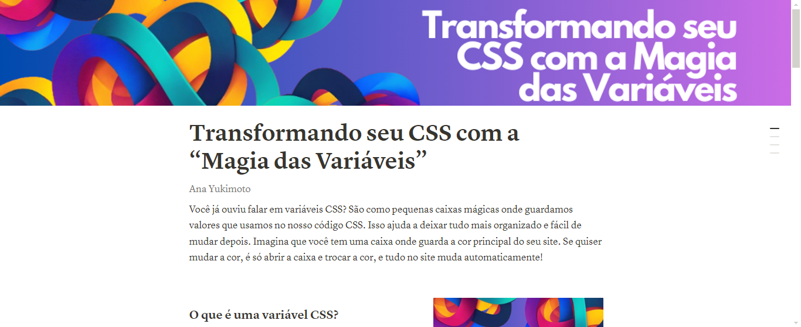

# Artigo-Gerado-com-IA

> Repositório criado para demonstração do projeto desenvolvido com o curso da DIO. Com uso da Inteligência Artificial.

### Link para o artigo 🔗
[Acesse o artigo completo aqui](https://www.notion.so/Transformando-seu-CSS-com-a-Magia-das-Vari-veis-bf5828bc047f4e1a91b67cd0a10837b9?pvs=4)

### O que você vai encontrar no artigo 📰

1. O que é uma variável CSS?
2. Como aplicar variáveis CSS?
3. Exemplo prático com código
